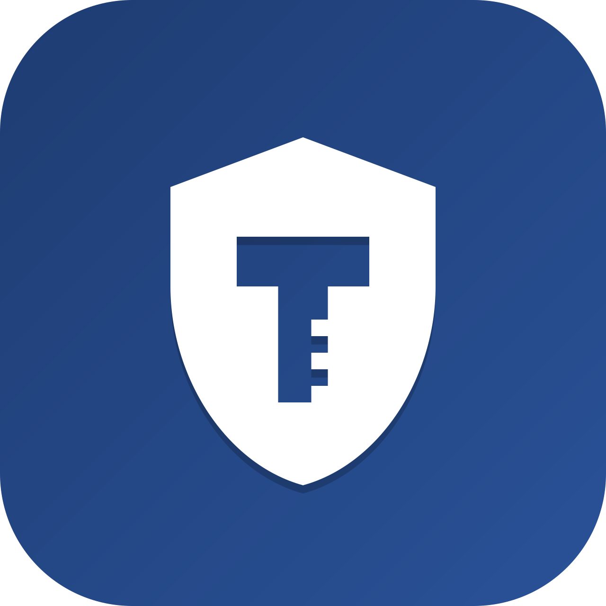

<p align="center">
  
</p>

<h1 align="center">TadaKey 2FA</h1>

<p align="center">
  <strong>Local digital vault for code editors with two-factor authentication</strong>
</p>

<p align="center">
  <a href="https://github.com/TadashiDevs/tadakey2fa/blob/main/LICENSE">
    
  </a>
  <a href="https://github.com/TadashiDevs/tadakey2fa">
    
  </a>
</p>

<p align="center">
  You can find my extensions on the <a href="https://marketplace.visualstudio.com/publishers/TadashiDev">VS Code Marketplace</a> or the <a href="https://open-vsx.org/namespace/TadashiDev">Open VSX</a>
</p>


## Preview

<p align="center">
  
</p>

## Features

- 🔐 **2FA Protected Vault** - TOTP authentication required to unlock
- 🔑 **API Keys** - Store tokens and secrets securely
- 👤 **Logins** - Save site, username, and password combinations
- 📝 **Secure Notes** - Store SSH keys, JSON configs, recovery codes
- 🔍 **Search & Filter** - Quickly find entries by name or username
- ⭐ **Pin Favorites** - Keep frequently used items at the top
- 🎨 **Theme Support** - Adapts to VS Code light/dark themes
- 📋 **One-Click Copy** - Copy secrets to clipboard instantly
- ⏱️ **Auto-Hide** - Revealed secrets hide after 15 seconds

## Installation

1. Open VS Code
2. Go to Extensions (`Ctrl+Shift+X`)
3. Search for "TadaKey 2FA"
4. Click Install

<details>
<summary>🐧 <strong>Linux Security Requirements</strong> (Click to expand)</summary>

If you encounter the error **"An OS keyring couldn't be identified"** or extension secrets are not saving, follow these steps:

### 1. Install Dependencies

Choose the command for your distribution:

| Distribution | Command |
|--------------|---------|
| **Arch Linux / Manjaro** | `sudo pacman -S gnome-keyring libsecret seahorse` |
| **Debian / Ubuntu / Mint** | `sudo apt install gnome-keyring libsecret-1-0 seahorse` |
| **Fedora** | `sudo dnf install gnome-keyring libsecret seahorse` |

### 2. Setup the Keyring (GUI)

1. Open **Seahorse** (search for "Passwords and Keys" in your menu)
2. Click the **+** button and select **"Password Keyring"**
3. Name it exactly: `Login`
4. Right-click on the new "Login" keyring and select **"Set as default"**
5. Ensure the padlock icon is **open** (Unlocked)

### 3. Configure your Editor

You must tell the editor to use the system keyring:

1. Open the Command Palette (`Ctrl+Shift+P`)
2. Type: `Preferences: Configure Runtime Arguments`
3. This will open `argv.json`
4. Add the following line (ensure correct JSON commas):
   ```json
   "password-store": "gnome"
   ```
5. Restart your editor completely

### 🛠️ Fix: "InvalidStateError: Failed to register a ServiceWorker"

If after configuring the keyring the extension shows a "Service Worker" or "Invalid State" error, the interface cache is corrupted. Clear it manually:

1. **Close the editor completely**
2. **Delete the Service Worker cache** (choose your editor):
   ```bash
   # For VS Code
   rm -rf ~/.config/Code/"Service Worker"
   
   # For VSCodium
   rm -rf ~/.config/VSCodium/"Service Worker"
   
   # For Antigravity
   rm -rf ~/.config/Antigravity/"Service Worker"
   ```
3. **Optional verification** - Find the folder before deleting:
   ```bash
   find ~/.config -name "Service Worker" -type d 2>/dev/null
   ```
4. **Restart your editor** - The interface will regenerate cleanly

</details>

## Getting Started

1. Click the TadaKey icon in the Activity Bar
2. Set up your security question and answer
3. Scan the QR code with your authenticator app (Google Authenticator, Authy, etc.)
4. Enter the 6-digit code to activate your vault
5. Start adding your secrets!

## Security

- **AES-256 Encryption** - All secrets are encrypted locally
- **TOTP Authentication** - Standard 2FA protocol
- **No Cloud Storage** - Everything stays on your machine
- **VS Code SecretStorage** - Uses VS Code's secure storage API

## Entry Types

| Type | Fields | Use Case |
|------|--------|----------|
| 🔑 API Key | Name, Secret | API tokens, environment variables |
| 👤 Login | Site, Username, Password | Website credentials |
| 📝 Note | Title, Content | SSH keys, JSON, multi-line text |

## Recovery

Lost your 2FA device? Use your security question to recover access and set up a new authenticator.

## 💬 Feedback & Support

If you find this extension useful, please consider:

⭐ **Leave a star** - Help others discover this extension!

💬 **Write a review** - Your feedback helps us improve

If you have any theme requests or issues, please [open an issue](https://github.com/TadashiDevs/tadakey2fa/issues/new).


## 📄 License

[MIT](https://github.com/TadashiDevs/tadakey2fa/blob/main/LICENSE) © [TadashiDevs](https://github.com/TadashiDevs)
